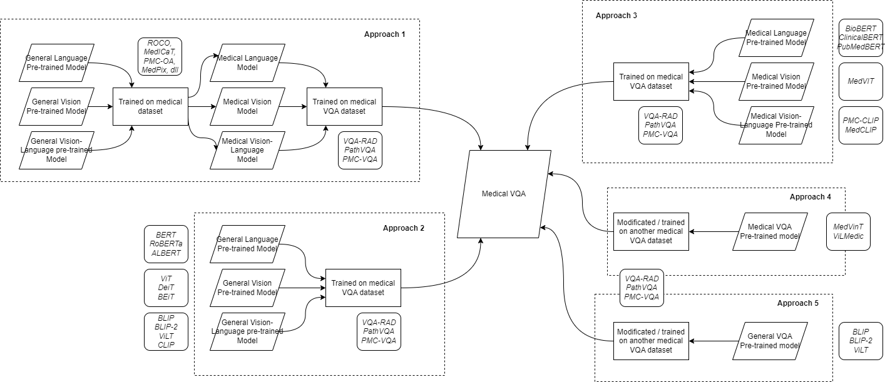
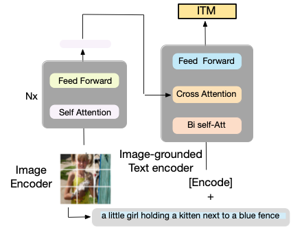

# cek
---
title: VQA Kalbe Bangkit
emoji: 🏆
colorFrom: blue
colorTo: purple
sdk: gradio
sdk_version: 4.31.5
app_file: app.py
pinned: false
---

# Kalbe Farma - Visual Question Answering (VQA) for Medical Imaging

## Overview
The project addresses the challenge of accurate and efficient medical imaging analysis in healthcare, aiming to reduce human error and workload for radiologists. The proposed solution involves developing advanced AI models for Visual Question Answering (VQA) to assist healthcare professionals in analyzing medical images quickly and accurately. These models will be integrated into a user-friendly web application, providing a practical tool for real-world healthcare settings.  we provide fine-tune for medical imaging vqa task with unimodal model using VGG19-GPT2 and multimodal model using BLIP and idefics2

## Dataset
this project fine-tune pre-trained VLM model using these datasets :
rad-vqa dataset : https://huggingface.co/datasets/flaviagiammarino/vqa-rad
slake dataset : https://huggingface.co/datasets/mdwiratathya/SLAKE-vqa-english
roco dataset : https://huggingface.co/datasets/mdwiratathya/ROCO-radiology

## Model Architecture
<!-- The model uses a Parameterized Hypercomplex Shared Encoder network (PHYSEnet). -->

unimodal : VGG19 for vision and GPT2 for text

multimodal : blip

multimodal : idefics2

Reference: [ScienceDirect](https://www.sciencedirect.com/science/article/abs/pii/S0933365723001252)

## Evaluation
the table below show evaluate result for fine-tuned model on medical dataset.

## File Description
1. vgg19gpt2.ipnyb is fine-tune file for
2. blip.ipnyb
3. idefics2.ipnyb

## Demo
for demo vqa-task, visit our huggingface space : https://huggingface.co/spaces/KalbeDigitalLab/IDEFICS2-8B-MedicalVQA

## Usage

