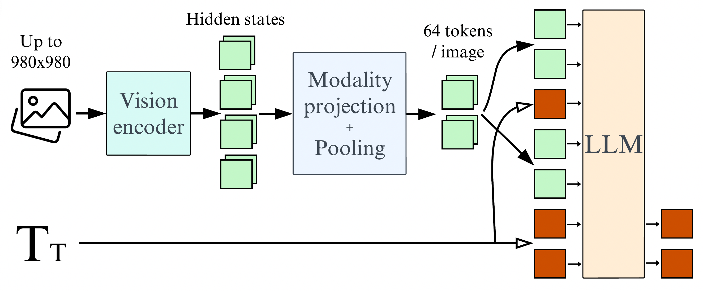

# Kalbe Digital Lab - Visual Question Answering (VQA) for Medical Imaging

## Overview
This project addresses the challenge of accurate and efficient medical imaging analysis in healthcare, aiming to reduce human error and workload for radiologists. The proposed solution involves developing advanced AI models for Visual Question Answering (VQA) to assist healthcare professionals in analyzing medical images (radiology images) quickly and accurately. These models will be integrated into a user-friendly web application, providing a practical tool for real-world healthcare settings.  We provide fine-tune for medical imaging vqa task with unimodal model using VGG19-GPT2 and VGG19-BioGPT that adapted from https://github.com/ab3llini/Transformer-VQA. We also fine-tune multimodal model using BLIP and Idefics2.

## Dataset
We fine-tune pre-trained VLM model using these datasets :

VQA-RAD dataset : https://huggingface.co/datasets/flaviagiammarino/vqa-rad

SLAKE dataset : https://huggingface.co/datasets/mdwiratathya/SLAKE-vqa-english

ROCO dataset : https://huggingface.co/datasets/mdwiratathya/ROCO-radiology

## Model Architecture
This is the architecture of Idefics2 model

We don't change all of the models architecture, so for further details of each model please refer to the original repository of paper below

## Evaluation
The table below shows the accuracy results for the fine-tuned models on the VQA-RAD and SLAKE datasets.

| Model        | Pre-fine-tune Dataset | VQA-RAD Accuracy | SLAKE Accuracy |
|--------------|-----------------------|------------------|----------------|
| BLIP         | -                     | 44.57%           | 67.58%         |
| VGG-GPT2     | -                     | 27.72%           | 28.09%         |
| VGG-BioGPT   | -                     | 27.40%           | 27.24%         |
| Idefics2-8B  | -                     | 53.22%           | 76.26%         |
| Idefics2-8B  | ROCO                  | 51.00%           | 81.00%         |

## File Description
in notebooks folder, there are files for that used to preprocess datasets and fine-tune models
1. notebooks/BLIP(vqa_base)_SLAKE.ipynb
2. notebooks/BLIP(vqa_base)_VQARAD.ipynb
3. notebooks/FT_Idefics_2_ROCO.ipynb
4. notebooks/FT_Idefics_2_VQA.ipynb
5. notebooks/VGG_GPT2_BioGPT.ipynb
6. notebooks/preprocessing_PMCVQA_small.ipynb
7. notebooks/preprocessing_ROCO.ipynb
8. notebooks/preprocessing_SLAKE.ipynb

## Demo
We provide web app demonstration for this medical VQA task using the best model: Idefics2-8B, visit our 🤗Hugging Face Spaces : https://huggingface.co/spaces/KalbeDigitalLab/IDEFICS2-8B-MedicalVQA

## Reference :
Idefics2
- https://arxiv.org/pdf/2405.02246
- https://huggingface.co/blog/idefics2

BLIP
- https://arxiv.org/pdf/2201.12086
- https://huggingface.co/Salesforce/blip-vqa-base

VGG-GPT2
- https://github.com/ab3llini/Transformer-VQA
- https://huggingface.co/openai-community/gpt2
- https://huggingface.co/microsoft/biogpt
